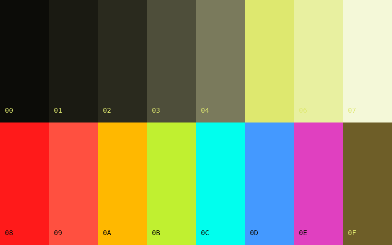

# Runner Shell

A [base16](https://github.com/tinted-theming/home) color scheme featuring Marathon-inspired neon accents on an olive/chartreuse base.

## Palette

| Base | Hex       | Role                    |
|------|-----------|-------------------------|
| 00   | `#0c0c08` | Olive Black (bg)        |
| 01   | `#1a1a12` | Dark Olive (lighter bg) |
| 02   | `#2a2a1e` | Olive Gray (selection)  |
| 03   | `#4e4e3a` | Muted Olive (comments)  |
| 04   | `#7a7a5c` | Khaki Dim (dark fg)     |
| 05   | `#dee86f` | Chartreuse (text)       |
| 06   | `#e8f0a0` | Pale Lime (emphasis)    |
| 07   | `#f4f8d8` | Cream White (headings)  |
| 08   | `#ff1a1a` | Signal Red (errors)     |
| 09   | `#ff5040` | Hot Coral (constants)   |
| 0A   | `#ffb800` | Hard Gold (classes)     |
| 0B   | `#c0f030` | Marathon Neon (strings) |
| 0C   | `#00ffee` | Neon Cyan (regex)       |
| 0D   | `#4499ff` | Cobalt Bright (funcs)   |
| 0E   | `#e040c0` | Hot Magenta (keywords)  |
| 0F   | `#6e5e28` | Olive Gold (special)    |

## Preview



## Usage

Use with any base16 template builder or copy the values directly into your theme configuration.

### NixOS/Stylix

```nix
stylix.base16Scheme = ./runner-shell.yaml;
```

## License

MIT
